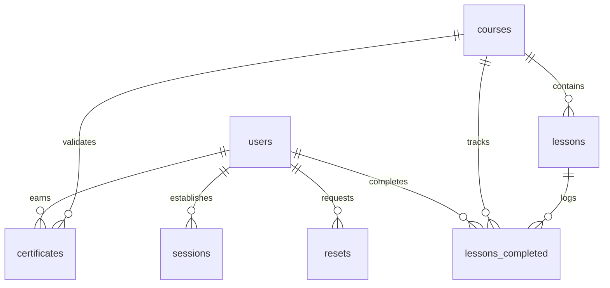

# Design Document: LMS Database Management System

## Personal Information

* **Project Title**: LMS Database Management System
* **Name**: Thyago Euclides
* **GitHub Username**: Thyagovz
* **edX Username**: flooddk
* **City and Country**: Curitiba, Paraná, Brazil
* **Date**: July 25, 2026
* **Video Overview URL**: https://www.youtube.com/watch?v=ZxEOx2DPA08

---

## Functional Overview

The purpose of this database is to manage a robust backend infrastructure for an online education platform. It tracks user authentication, active learning sessions, secure password resets, a hierarchical structure of courses and video lessons, granular lesson progress tracking, and secure certificate generation.

This system addresses several core administrative and user experience challenges:
1. **User Management**: Maintaining secure access records while keeping track of profile updates.
2. **Session and Security Control**: Preventing unauthorized access by tracking dynamic session and password reset tokens that feature built-in expiration dates.
3. **Course Progress Tracking**: Recording every single video lesson completed by students to accurately measure course engagement.
4. **Automated Certification**: Generating tamper-proof course completion certificates with cryptographic-friendly unique IDs once a student finishes all corresponding course content.

---

## Scope

The scope of this database encompasses the entire student lifecycle and content catalog of a modern e-learning application. The database strictly manages the following domains:

* **User Accounts and Security**: Storing user profiles and facilitating secure operations through tokenized session tracking and password expiration routines.
* **Academic Catalog**: Storing details of available courses, including titles, descriptions, total durations, and the sequential flow of specific video lessons.
* **Student Analytics and Achievements**: Logging exact timestamps for completed lessons and storing issued certificates.

### Out of Scope
The database explicitly excludes payment gateways, financial transaction logs, user-submitted code files (such as workspace sandboxes), and raw video streaming hosting files, which are offloaded to third-party CDNs (Content Delivery Networks).

---

## Functional Requirements

The system supports the following core operations, as documented inside the `queries.sql` file:
* Registering new user accounts and managing credentials.
* Authenticating logins by validating active tokens and enforcing session expirations.
* Fetching organized course curricula and mapping navigation links for previous and next lessons.
* Dynamically calculating real-time study statistics, such as total watch time and total course completion percentages.
* Emitting non-duplicable certificates immediately upon curriculum conclusion.

---

## Entities and Schema Design

The schema follows a relational design enforced by strict type rules using the `STRICT` modifier in SQLite. It consists of the following entities:

### 1. `users`
* **Purpose**: Represents the students and system administrators.
* **Attributes**: Features an `id` (INTEGER PRIMARY KEY), `name`, `password_hash`, `email`, and `username`. Both the `email` and `username` columns utilize `COLLATE NOCASE UNIQUE` to avoid duplicate registrations based on case sensitivity (e.g., preventing 'John' and 'john' from registering as different users).
* **Timestamps**: Includes automated `created` and `updated` tracking strings.

### 2. `courses`
* **Purpose**: Represents the high-level educational programs available.
* **Attributes**: `id` (INTEGER PRIMARY KEY), a unique URL-friendly `slug`, `title`, `description`, total number of `lessons`, and total course `hours`.

### 3. `resets`
* **Purpose**: Tracks temporary tokens requested by users to reset forgotten passwords.
* **Attributes**: Uses the `token` string as a PRIMARY KEY (`WITHOUT ROWID`) to optimize lookup performance. Stores the `user_id` as a foreign key, the origin `ip` address, a UNIX timestamp for when it was `created`, and an integer representation for when the token `expires`.

### 4. `sessions`
* **Purpose**: Controls concurrent cookie authentication tokens for active user sessions.
* **Attributes**: Implements `token` as the PRIMARY KEY (`WITHOUT ROWID`). Tracks `user_id`, login `ip`, creation time, and an expiration timestamp to automatically invalidate old tokens.

### 5. `lessons`
* **Purpose**: Contains the individual atomic learning modules (videos) tied to a course.
* **Attributes**: `id` (INTEGER PRIMARY KEY), a foreign key reference to `course_id`, an internal classification system (`materia` and `materia_slug`), duration in `seconds`, the CDN `video` file reference, a short text `description`, and a curriculum sequence placeholder called `order`. The `free` column enforces boolean constraint checks (`CHECK ("free" IN (0, 1))`).
* **Constraints**: Enforces a `UNIQUE ("course_id", "slug")` composite rule to prevent URL collision.

### 6. `lessons_completed`
* **Purpose**: A junction table establishing a many-to-many relationship tracking user progress.
* **Attributes**: Employs a composite primary key consisting of `("user_id", "course_id", "lesson_id")` and operates `WITHOUT ROWID`. This optimization reduces storage overhead by embedding the data directly within the index structure.

### 7. `certificates`
* **Purpose**: Represents official achievements issued to students.
* **Attributes**: Features a cryptographic string `id` that defaults to a generated lowercase hexadecimal blob (`lower(hex(randomblob(8)))`). This hides sequential row values from public scrutiny. It features a `UNIQUE ("user_id", "course_id")` rule to guarantee that a student can never hold duplicate certificates for a single course.

---

## Relationships

Below is the conceptual representation of the relationships embedded within our physical model:

* **One-to-Many (`users` to `resets`/`sessions`)**: A single user can have multiple active devices or password reset requests over time. If a user account is removed, all cascading records are deleted (`ON DELETE CASCADE`).
* **One-to-Many (`courses` to `lessons`)**: A course contains numerous lessons, but a single lesson belongs to exactly one course curriculum.
* **Many-to-Many (`users` to `lessons` / `users` to `courses`)**: Facilitated cleanly by the `lessons_completed` and `certificates` intersection tables to model structural real-world progression.

---

## Optimizations

To guarantee rapid data retrieval cycles under heavy server strain, several architectural optimizations were implemented:

### Indexes
* `idx_resets_user_id` & `idx_sessions_user_id`: Essential for rapid authentication middleware evaluations during API calls.
* `idx_lessons_order`: A composite index grouping `course_id` and `order`. This allows the application to pull a clean chronological syllabus or compute adjacent records instantly without executing full table scans.
* `idx_certificates_user`: Optimizes profile layout loads by gathering all user awards quickly.

### Database Tuning (`PRAGMA`)
* **WAL Mode (`journal_mode = WAL`)**: Enabled to support concurrent write/read executions. Writers write changes to a separate log file, meaning readers are never blocked while fetching content.
* **Memory Architecture (`temp_store = MEMORY`)**: Forces temporary tables and query sorting pools into RAM rather than slow magnetic disk arrays.

### Virtual Entities (Views)
* `lessons_completed_full` & `certificates_full`: Pre-compiled multi-table database abstractions. They combine disjoint pieces of entity state into high-utility reports, encapsulating nested loops away from the main application codebase.

### Automation Layer (Triggers)
* `set_users_updated`: Implemented an automated database-level event loop listener. When any user column is updated, this trigger updates the timestamp within the database layer. It contains an inline conditional check `WHEN NEW."updated" IS OLD."updated"` to eliminate endless cascading query execution loops.

---

## Limitations

While highly optimized for web application standards, the current layout possesses a few architectural limitations:
* **Time Tracking Limits**: The `lessons_completed` tracking engine operates under a binary flag system (either a video is completed or it is not). It cannot natively log real-time pause states or partially watched video markers (e.g., saving that a student paused at minute 12:30).
* **Certificate Immutability**: Because certificates are generated inside a `WITHOUT ROWID` structure, changing course titles retrospectively will change historical data displayed inside our database views (`certificates_full`). This could modify historical records if an active course changes its name years later.
